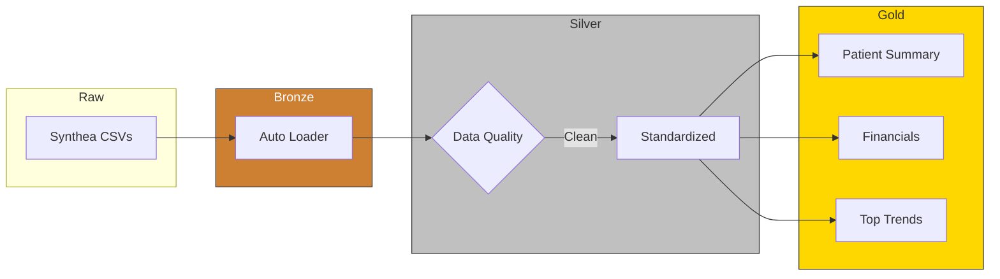

## Healthcare Lakehouse with Delta Live Tables (DLT)

**Built a declarative healthcare data pipeline using Delta Live Tables with integrated data quality and streaming ingestion.**

---

### Overview

This project implements a **Medallion Architecture (Bronze → Silver → Gold)** on Databricks using **Delta Live Tables (DLT)**.

It demonstrates how to build a **production-style data pipeline** with:
- Streaming ingestion (Auto Loader)
- Built-in data quality validation
- Declarative transformations
- Analytics-ready outputs

---

### Architecture

#### Bronze — Raw Ingestion
- Ingested Synthea healthcare CSV data using Auto Loader (`cloudFiles`)
- Enabled schema inference and evolution
- Captured malformed records in `_rescued_data`
- Applied data quality checks at ingestion

---

#### Silver — Data Cleaning & Standardization
- Standardized column names using `snake_case`
- Filtered invalid records (nulls, invalid values)
- Casted fields to appropriate data types
- Produced clean, structured datasets

---

#### Gold — Analytics Layer

**Built aggregated, business-ready tables:**
- `patient_summary` → patient demographics + encounter counts  
- `encounters_per_patient` → visit frequency  
- `claims_cost_per_patient` → financial aggregation  
- `top_conditions`, `top_medications`, `top_allergies` → frequency analysis  

---

### Delta Live Tables (Core)

- Defined pipelines using:
  - `@dlt.table`
  - `@dlt.expect` and `@dlt.expect_or_fail`
- Used declarative transformations instead of manual orchestration
- Enabled automatic:
  - Dependency management  
  - Scheduling  
  - Lineage tracking  

---

### Data Quality

Implemented DLT expectations directly in the pipeline:

- Enforced critical constraints (`expect_or_fail`)
- Logged non-critical issues (`expect`)

**Examples:**
- Non-null IDs  
- Valid timestamps  
- Non-negative financial values  

Data quality is enforced **within the pipeline**, not as a separate step

---

### Key Features

- Declarative pipeline design (DLT)
- Streaming ingestion with Auto Loader
- Built-in data validation framework
- Medallion architecture (Bronze → Silver → Gold)
- Reusable ingestion and transformation functions

---

### Key Takeaway

Demonstrates how to build a **reliable, declarative data pipeline** using Delta Live Tables by integrating ingestion, transformation, and data quality into a single managed workflow.

---

### Design Decision

Initially implemented using a multi-tool approach (dbt-based transformations), then migrated to a unified Delta Live Tables pipeline to simplify orchestration, integrate data quality, and reduce operational complexity.

Highlights a shift from fragmented ETL tools to a **managed, declarative pipeline architecture**.