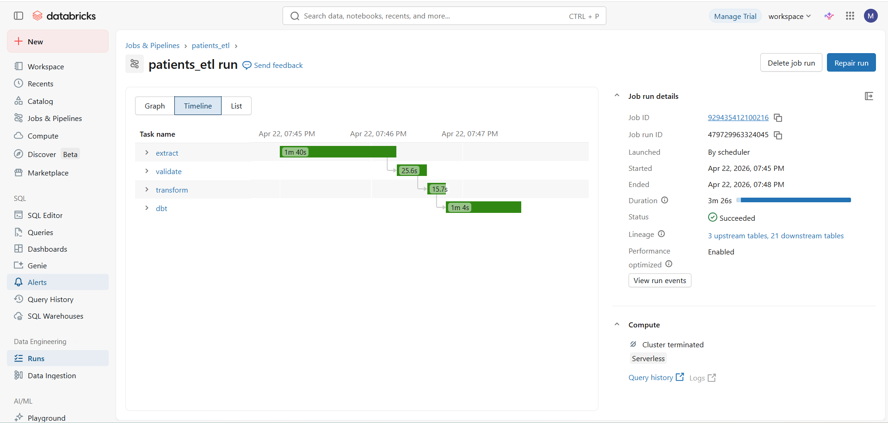
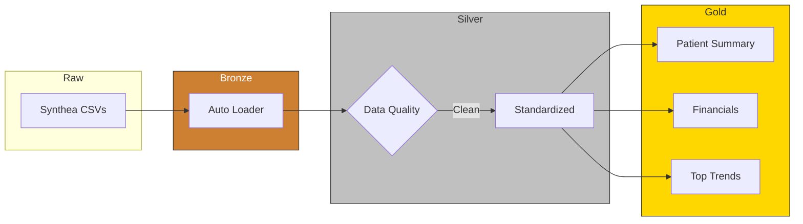
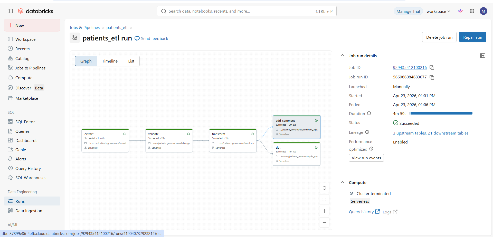

## Phase I: Healthcare Lakehouse with dbt-based ETL (Previous Design)

Earlier version of this project used a dbt-based ETL pipeline on Databricks.

- Built Bronze → Silver → Gold layers using dbt models  
- Used `dbt run` for transformations across layers  
- Applied basic data tests (`not_null`, `unique`) on key tables like patients, encounters, and claims  
- Pipeline logic was spread across multiple dbt models

  
### Figure 1: ETL job run (Phase I – previous design)
  - 

## Phase II: Healthcare Lakehouse with Delta Live Tables (DLT)

**Built a declarative healthcare data pipeline using Delta Live Tables with integrated data quality and streaming ingestion.**

---

### Overview

This project implements a **Medallion Architecture (Bronze → Silver → Gold)** on Databricks using **Delta Live Tables (DLT)**.

It demonstrates how to build a **production-style data pipeline** with:
- Streaming ingestion (Auto Loader)
- Built-in data quality validation
- Declarative transformations
- Analytics-ready outputs

---

### Architecture

#### Bronze — Raw Ingestion
- Ingested Synthea healthcare CSV data using Auto Loader (`cloudFiles`)
- Applied data quality checks at ingestion

---

#### Silver — Data Cleaning & Standardization
- Cleaned and standardized datasets
- Handled nulls and type casting

---

#### Gold — Analytics Layer

**Built business-ready and AI-enriched tables for analytics and exploration.**

- AI-generated semantic mapping of healthcare description fields into short human-readable meanings using `ai_query`
- Aggregated EDA tables such as `top_conditions`
- Summary statistics tables like `ai_summary_stats` for text and field-level insights

---
### DLT Features Used

- `@dlt.table` for declarative pipeline
- `@dlt.expect` for data quality checks
- Automatic lineage and dependency handling
- Built-in orchestration (no external scheduler)

---

### Design Decision

DLT made things easier because I didn’t have to manage job order or dependencies across multiple models. 
It just figures out the pipeline flow from the tables themselves.

### Figure 1: DLT Pipeline (Phase II)
- 